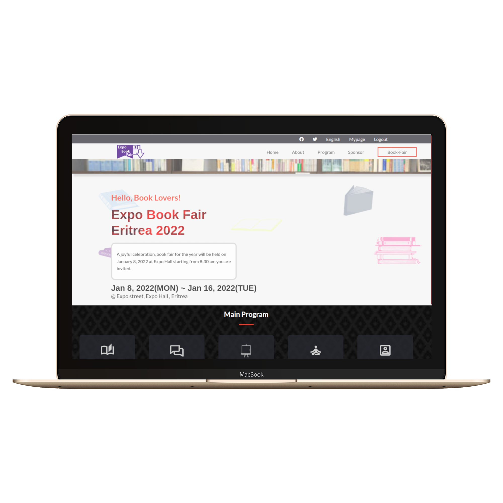

# dbus-first-capstone: Expo Book Fair

>It's a web app designed to invite book lovers that contain two pages with different sections. It is also a capstone project on the Microverse HTML/CSS module. Implement DOM using javascript methods with various tools and technologies.

### ScreenShoot Mobile Version

### ScreenShoot Desktop Version

### Built With

- HTML5
- CSS3
- JS

### Live Demo

[Visit the Live Demo](https://debas-31.github.io/dbus-first-capstone/)

### Install

To get a local copy up and running follow these simple example steps.
- Open terminal
- Clone this project by the command `git clone https://github.com/Debas-31/dbus-first-capstone`
- `cd repository_name` folder
- Open `index.html` in your local browser or using Live Server in Visual Studio Code.
### 

👤 **Debas Gebreslasie**

- [GitHub](https://github.com/Debas-31)
- [Twitter](https://twitter.com/DEBSH76956492)
- [LinkedIn](https://www.linkedin.com/in/debas-gebrengus)

### 🤝 Contributing

Contributions, issues, and feature requests are welcome!

Feel free to check the [issues page](https://github.com/Debas-31/dbus-first-capstone/issues).

### Show your support

Give a ⭐️ if you like this project!

### Acknowledgments
- Github
- Unsplash
- Font Awesome
- Cindy Shin, author of the original design

## 📝 License

This project is [MIT](https://github.com/Debas-31/dbus-first-capstone/blob/my-first-capstone-project/MIT.md) licensed.
